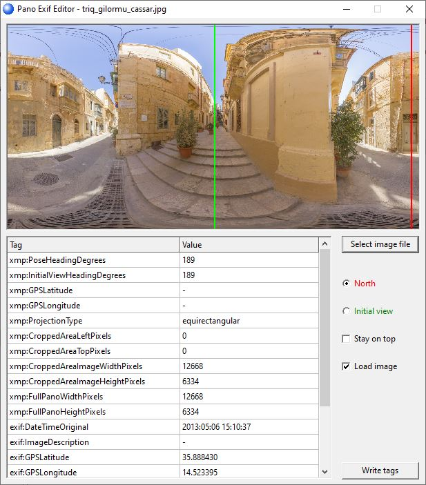

## Pano Exif Editor
An [exiftool](http://owl.phy.queensu.ca/~phil/exiftool/) GUI to quickly put needed exif tags.  
  
Google's streetview, 360cities and other services use or need special exif tags to accelerate or facilitate the publication. This program allows fast and convenient setting of these tags.
This is a Lazarus project.
Note: only equirectangular panoramas are supported.

